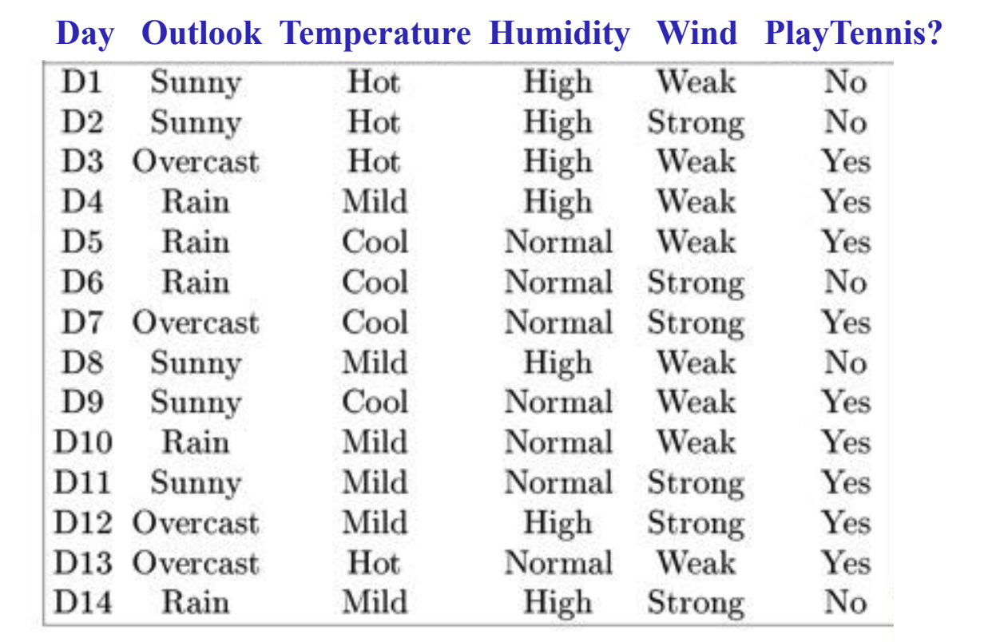

## What is Decision Tree and Why Do We Want to Use It?
You can treat decision tree as a function approximator, which takes in an input with `n` attributes **`x`**`∈ ℝ^n`, and outputs a result `y`.  For example, 

*taken from CMU 10601 lecture note*

In the dataset shown above, if the weather is sunny and the temperature is hot, the tennis event is always canceled. Thus, if we are given a new input in the future with sunny weather and hot temperature, these two attributes should inform our trained decision tree that, the tennis is unlikely to happen today either.

We can see from this example that, one of the biggest advantages of DT is its straightforwardness. The learning process is super intuitive and friendly to the people without machine learning knowledge. Also, because of the tree structure, the computation and memory are efficient. Moreover, this method can be widely used in various problems including classification, regression, etc.

## How to Decide Which Attribute We Should Used
In the example above, though there are four attributes presented, they are not equally critical to our problem. Actually, using all the provided attributes can normally lead to over-fitting issues. To build a decision tree, we usually want to start from the most important attribute, i.e., the attribute that reveals the most information. To find out which attribute yields the best classifier, the following four concepts in information theory need to be discussed: entropy, specific conditional entropy, conditional entropy, and mutual information.
### Entropy

